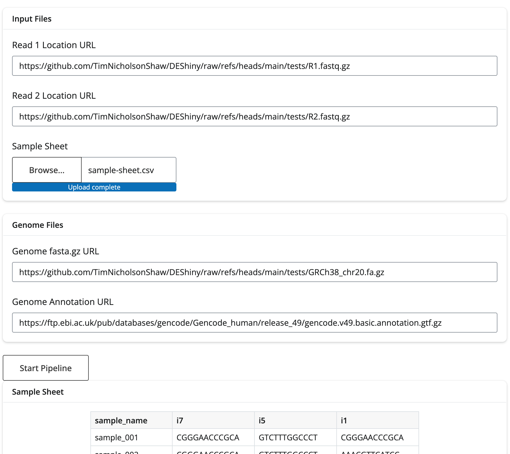
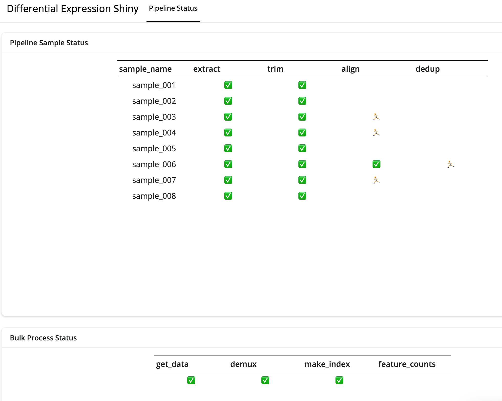

# DEShiny
## A pipeline for processing and visualization of Lexogen Quantseq Pool data

## Notes:
- The docker image is available from timnicholsonshaw/deshiny
- Shiny app will run on port 8080
- Example sample sheet is available in the tests folder, default URLs should work for testing

## Features
- A page for setting pipeline options with input validation coming soon

- A dashboard for visualization of pipeline status

